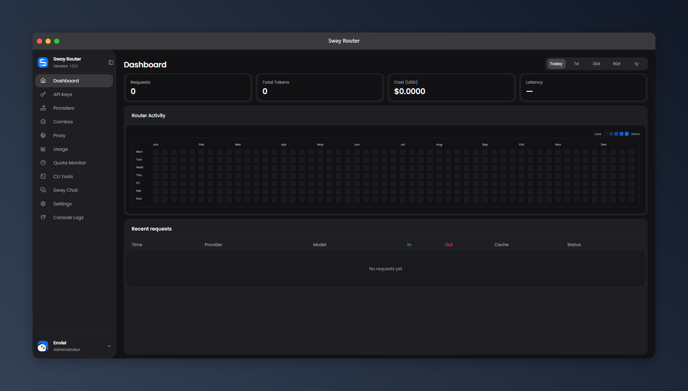
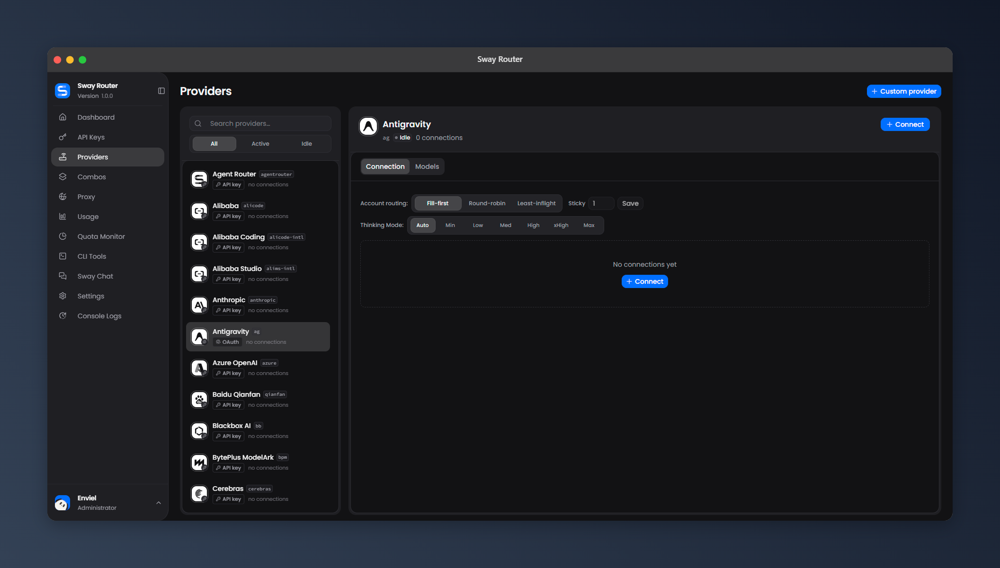
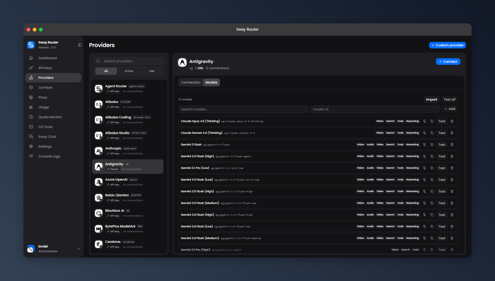
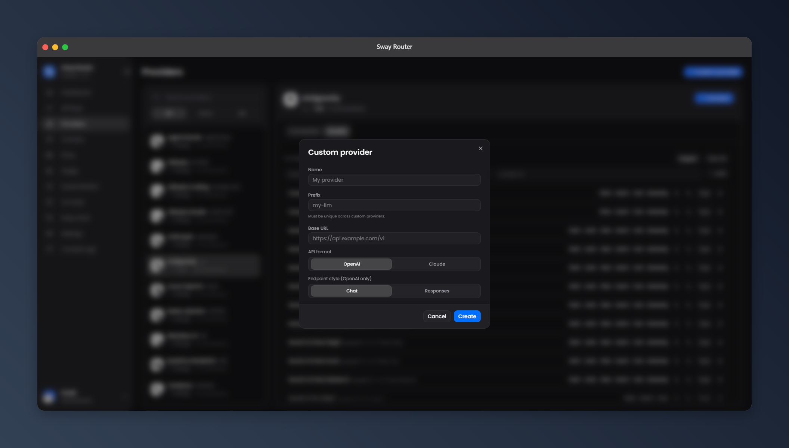
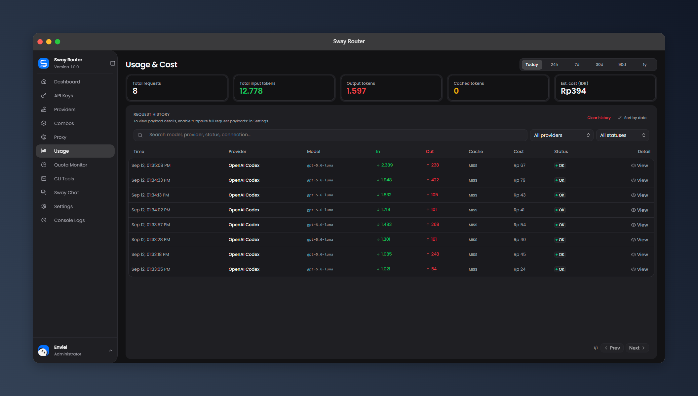
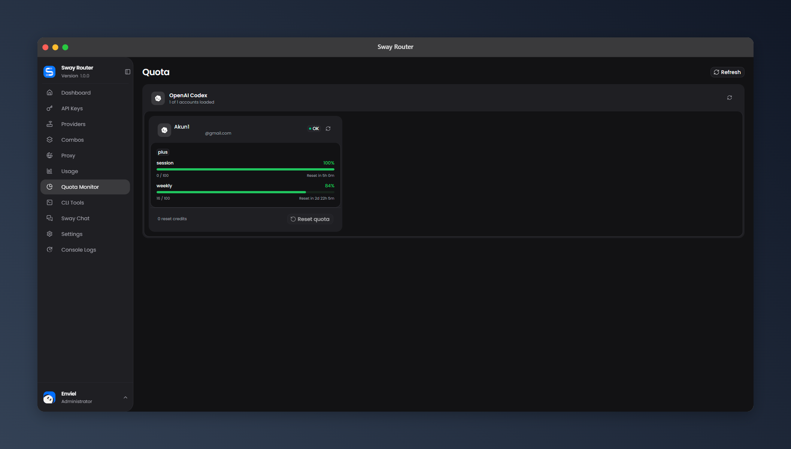
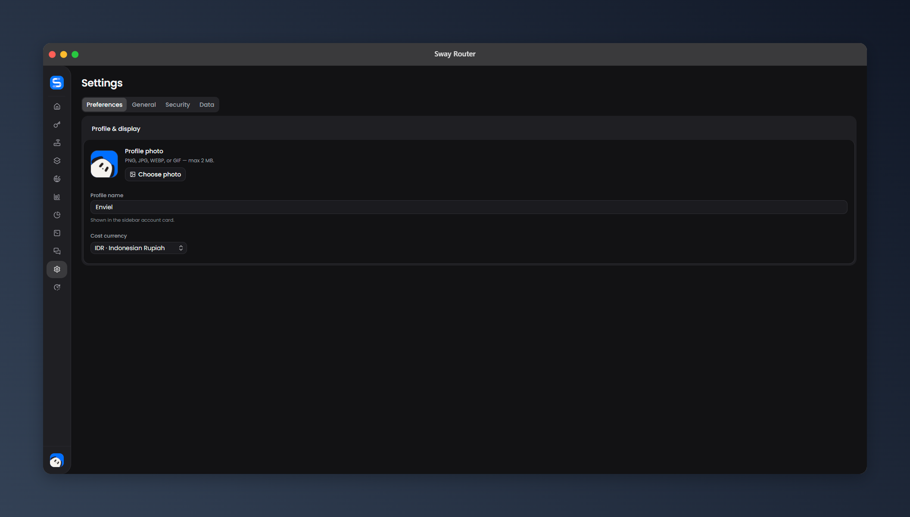
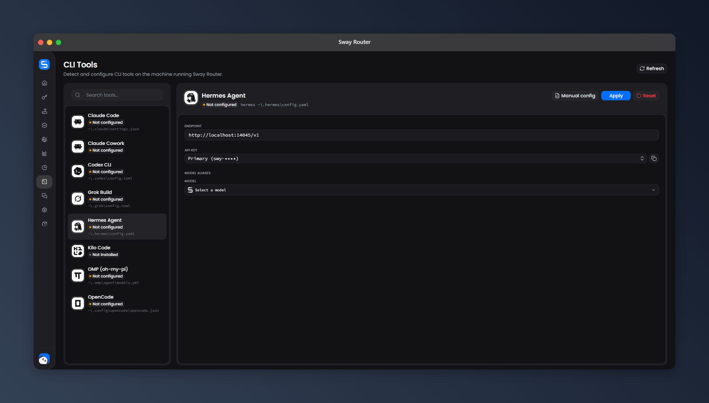

<div align="center">
  
  <h1 style="margin: 8px 0 0;">Sway Router</h1>
</div>

<p align="center">
  <strong>One gateway. Every model.</strong><br />
  Connect once, route anywhere.
</p>

<p align="center">
  <a href="./README.md"></a>
  <a href="./README.id.md"></a>
</p>

<p align="center">
  <a href="https://github.com/envielxyz/SwayRouter/stargazers"></a>
  <a href="./LICENSE"></a>
  <a href="https://bun.sh"></a>
  <a href="https://www.typescriptlang.org"></a>
  <a href="https://react.dev"></a>
  <a href="https://sqlite.org"></a>
</p>

<p align="center">
  
</p>

Sway Router brings all your AI providers into one clean gateway, with a simple
dashboard to manage models, routing, and usage.

## Contents

- [Get started](#get-started)
- [Requirements](#requirements)
- [HTTP API](#one-http-api-for-your-whole-stack)
- [Dashboard](#the-dashboard-you-actually-want-to-use)
- [Migrate from 9Router](#migrate-from-9router)
- [Providers](#providers)
- [Features](#what-sway-router-can-do)
- [Comparison](#sway-router-vs-9router-vs-omniroute)
- [Operations and security](#operations-and-security)
- [Tech stack](#tech-stack)
- [Configuration](#configuration)
- [Attribution and license](#attribution)

## Get started

### Global CLI — the quick way

Install it globally and start the router:

```bash
bun install -g swayrouter@latest
swayrouter
```

The CLI can start, stop, restart, and check the router status. It also checks
for a newer version when starting up, but it will never update itself without
you saying so.

### Windows — local install

The easiest Windows setup is a local global install. If Bun is already
installed, skip the first step.

1. Open PowerShell and install Bun:

   ```powershell
   powershell -c "irm bun.sh/install.ps1 | iex"
   ```

2. Close and reopen PowerShell, then verify Bun:

   ```powershell
   bun --version
   ```

3. Install and start Sway Router:

   ```powershell
   bun install -g swayrouter@latest
   swayrouter start -b
   ```

4. Open `http://127.0.0.1:14045/dashboard` in your browser and finish the
   first-run setup.

5. Check or stop the local instance whenever you need:

   ```powershell
   swayrouter status
   swayrouter stop
   ```

The CLI keeps Sway Router's runtime data under `%APPDATA%\.swayrouter`.
You do not need to create a `.env` file for a normal local install.

### Windows — run from source

For contributors working from a checkout:

```powershell
git clone https://github.com/envielxyz/SwayRouter.git
cd SwayRouter
bun install --frozen-lockfile
Push-Location dashboard
bun install --frozen-lockfile
bun run build
Pop-Location
bun run dev
```

Then open `http://127.0.0.1:14045/dashboard`. Keep the terminal open while
the development server is running.

### Run from source (macOS/Linux)

```bash
bun install --frozen-lockfile
cd dashboard
bun install --frozen-lockfile
bun run build
cd ..
bun run dev
```

Then open `http://127.0.0.1:14045/dashboard` and connect your first provider.

Want to work on the dashboard? Run `bun run dev` inside `dashboard/` in a
second terminal.

### Docker — isolated and persistent

```bash
docker build -t swayrouter:latest .
docker compose up -d
docker compose ps
```

Docker also generates persistent secrets in its data volume. Copy
`.env.example` to `.env` only when you want explicit deployment overrides.

Open `http://127.0.0.1:14045/dashboard`. Follow the logs with:

```bash
docker compose logs -f swayrouter
```

The compose setup keeps the data in the `swayrouter-data` volume, publishes
the port to localhost only, runs as an unprivileged user, uses a read-only
root filesystem, and includes a readiness health check. Keep the volume if
you want to keep your provider connections, keys, settings, and usage data.

## Requirements

| Deployment | You need | Process manager |
| --- | --- | --- |
| Global CLI | Bun `1.3+`, a writable data directory, and provider network access | The CLI for local use; add a supervisor for production |
| Docker | Docker Engine with the Compose plugin and a persistent volume | Docker Compose handles restart and health checks; PM2 is not needed |
| Native VPS | Bun `1.3+`, a writable data directory, and provider network access | `systemd` is recommended; PM2 is optional |

For a small native VPS, start with **2 vCPU, 2 GB RAM, and 10 GB SSD**. A local
dev machine can run with less. Put Sway Router behind an HTTPS reverse proxy before
exposing it outside your private network.

### Native VPS with PM2 (optional)

PM2 supports Bun, but it is only needed when you run Sway Router directly on the VPS
instead of using Docker or another supervisor:

```bash
npm install -g pm2
pm2 start src/server.ts --name swayrouter --interpreter bun
pm2 save
pm2 startup
```

Run `pm2 startup` exactly as instructed by PM2 so it can restore the process
after a reboot. Do not run PM2 on top of Docker Compose for the same container.

## One HTTP API for your whole stack

Use the client format you already know. Sway Router translates requests and
responses for the provider behind the scenes.

| Client / feature | Endpoint |
| --- | --- |
| OpenAI Chat Completions | `POST /v1/chat/completions` |
| OpenAI Responses | `POST /v1/responses` |
| Compact Responses | `POST /v1/responses/compact` |
| Anthropic Messages | `POST /v1/messages` |
| Anthropic token count | `POST /v1/messages/count_tokens` |
| Ollama-style chat | `POST /v1/api/chat` |
| Image generation | `POST /v1/images/generations` |
| Image editing | `POST /v1/images/edits` |
| Model list | `GET /v1/models` |

Streaming and non-streaming requests are supported where the selected provider
and model support them. `/codex` and `/responses` aliases are included for
common client setups.

### Tiny example

```bash
export SWAY_API_KEY="swy-your_gateway_key"
curl http://127.0.0.1:14045/v1/chat/completions \
  --oauth2-bearer "${SWAY_API_KEY}" \
  -H "Content-Type: application/json" \
  -d '{
    "model": "your-active-model-id",
    "messages": [{"role": "user", "content": "Say hello"}]
  }'
```

Your Sway Router gateway key is separate from the provider credentials behind it.
Provider secrets stay on the server.

## The dashboard you actually want to use

The dashboard is not an afterthought. It is a focused control room for your
providers, models, accounts, quotas, usage, logs, and routing. Compact cards,
clear status badges, search and filters, responsive layouts, and smooth
loading/refresh states keep everything easy to scan and manage on desktop,
tablet, and mobile.

| Dashboard | Providers |
| --- | --- |
|  |  |
| Provider models | Custom provider |
|  |  |
| Usage & cost | Quota monitor |
|  |  |
| Settings | CLI Tools |
|  |  |

[Browse the full UI showcase](./docs/SHOWCASE.md)

### Main menu

| Menu | What is inside |
| --- | --- |
| **Dashboard** | Request count, token totals, cost, latency, provider activity, and system status |
| **API Keys** | Create, reveal, copy, rotate, enable, revoke, and delete gateway keys |
| **Providers** | Add connections, choose auth, test accounts, manage models, and configure routing |
| **Combos** | Build ordered model/provider fallback combos and choose combo strategies |
| **Proxy** | Create and test proxy pools, attach connections, and deploy optional relays |
| **Usage** | Charts, token breakdowns, estimated cost, history, filters, sorting, and request details |
| **Quota Monitor** | Provider/account availability, quota state, diagnostics, and manual refresh |
| **CLI Tools** | Configure supported coding tools, select models, and copy generated configs |
| **Sway Chat** | Chat through the router with model selection and optional built-in tools |
| **Settings** | Preferences, General, Security, Data controls, and 9Router migration |
| **Console Logs** | Search, filter, wrap, copy, and inspect runtime/provider diagnostics |

### Settings, properly mapped

- **Preferences:** profile photo with crop/zoom, profile name, and display
  currency (USD by default, IDR available).
- **General:** RTK token saver, Caveman, Ponytail, request payload capture,
  and Cloudflare Tunnel settings.
- **Security:** gateway API-key requirement, dashboard login requirement,
  dashboard password, login protection, and graceful shutdown.
- **Data:** database location, JSON backup/restore, and 9Router migration.

## Migrate from 9Router

Moving from 9Router is built into **Settings → Data → Migrate from 9Router**.
Sway Router supports both migration sources:

- **Local installation:** automatically finds a supported 9Router database on
  the same machine.
- **9Router JSON backup:** import an exported backup from this or another
  device.

Before importing, choose exactly what to bring over:

- Provider accounts and credentials
- Custom providers
- Custom models
- Combos
- Routing settings — off by default
- Activate imported accounts immediately — off by default

Sway Router previews the migration first and shows what is ready, already present,
or skipped. It validates the source, maps provider and model references to
Sway Router's format, removes duplicates, and reports incompatible or unavailable
providers instead of importing broken entries. Previewing does not change your
data.

When you confirm with your dashboard password, Sway Router creates a safety backup,
merges the selected data into the existing database, and refreshes the
dashboard. Existing Sway Router data is not replaced, and imported accounts remain
inactive unless you explicitly enable them during migration. Use **Import JSON**
for Sway Router backups; use **Migrate from 9Router** for 9Router backups.

## Providers

The built-in catalog currently shows **65 providers**. The list below is
generated from the providers available in the dashboard, not from a marketing
list. Provider availability and auth options can change as upstream services
change.

### API key — 44

| Provider | ID |
| --- | --- |
| Alibaba Coding | `alicode-intl` |
| Alibaba | `alicode` |
| Alibaba Studio | `alims-intl` |
| Anthropic | `anthropic` |
| Azure OpenAI | `azure` |
| Baidu Qianfan | `baidu` |
| Blackbox AI | `blackbox` |
| BytePlus ModelArk | `byteplus` |
| Cerebras | `cerebras` |
| Chutes AI | `chutes` |
| Cloudflare | `cloudflare-ai` |
| Command Code | `commandcode` |
| DeepSeek | `deepseek` |
| Featherless | `featherless` |
| Fireworks AI | `fireworks` |
| Gemini | `gemini` |
| GLM (China) | `glm-cn` |
| GLM Coding | `glm` |
| Groq | `groq` |
| Kilo Gateway | `kilo-gateway` |
| Minimax (China) | `minimax-cn` |
| Minimax Coding | `minimax` |
| Mistral | `mistral` |
| Morph | `morph` |
| Nebius AI | `nebius` |
| NVIDIA NIM | `nvidia` |
| Ollama Local | `ollama-local` |
| Ollama Cloud | `ollama` |
| OpenAI | `openai` |
| OpenCode Go | `opencode-go` |
| OpenRouter | `openrouter` |
| Perplexity AI | `perplexity` |
| Poolside | `poolside` |
| Tencent Hunyuan | `tencent` |
| Together AI | `together` |
| Venice AI | `venice` |
| Vercel AI Gateway | `vercel-ai-gateway` |
| Vertex Partner | `vertex-partner` |
| Vertex AI | `vertex` |
| Xiaomi MiMo | `xiaomi-mimo` |
| Xiaomi MiMo (Token Plan) | `xiaomi-tokenplan` |
| Meta AI | `meta` |
| Agent Router | `agentrouter` |
| SumoPod | `sumopod` |

Perplexity AI uses the official [Perplexity Router API](https://docs.perplexity.ai/docs/router/quickstart): one API key, one connection, and one live model catalog across OpenAI Chat Completions, OpenAI Responses, and Anthropic Messages.

### OAuth, device code, or token import — 19

| Provider | ID |
| --- | --- |
| Antigravity | `antigravity` |
| Claude Code | `claude` |
| Cline | `cline` |
| ClinePass | `clinepass` |
| CodeBuddy CN | `codebuddy-cn` |
| CodeBuddy | `codebuddy-intl` |
| OpenAI Codex | `codex` |
| Cursor IDE | `cursor` |
| Gemini CLI | `gemini-cli` |
| GitHub Copilot | `github` |
| Grok CLI (Grok Build) | `grok-cli` |
| Kilo Code | `kilocode` |
| Kimchi | `kimchi` |
| Kimi | `kimi` |
| Kiro AI | `kiro` |
| Qoder | `qoder` |
| Trae | `trae` |
| Windsurf | `windsurf` |
| xAI (Grok) | `xai` |

### Web cookie — 1

| Provider | ID |
| --- | --- |
| Grok Web (Subscription) | `grok-web` |

### No auth — 1

| Provider | ID |
| --- | --- |
| OpenCode Free | `opencode` |

## What Sway Router can do

### Providers and accounts

- Connect providers with API keys, OAuth, device code, cookies/sessions, or
  access/refresh tokens when that provider supports the flow.
- Add multiple accounts to one provider and set their priority or enabled state.
- Test a connection, test individual models, or test a whole provider batch.
- Import live model catalogs when an upstream endpoint is available.
- Add custom providers, custom nodes, custom models, aliases, and pricing.
- Mark model capabilities such as vision, audio, video, search, tools, and
  reasoning.
- Keep provider-specific IDs, endpoints, headers, and compatibility rules.

### Routing and fallbacks

- `fill-first` for predictable account usage.
- `round-robin` for simple rotation.
- `least-inflight` for spreading active work.
- `sticky` and `cache-affine` behavior when account stability matters.
- Per-provider routing overrides and sticky controls.
- Combos for ordered multi-model or multi-provider fallback.
- Account cooldowns, locks, endpoint fallback, and bounded retries.

### Translation and model support

- OpenAI, Anthropic, Responses, and Ollama-style request formats.
- Provider-specific request and response translation.
- Streaming conversion over SSE plus normal JSON responses.
- Tool calls, thinking/reasoning, vision, image input, media, and usage
  handling where supported by the selected model.
- Compatibility fallbacks for optional parameters that an upstream rejects.
- Dynamic model discovery, static catalogs, custom models, aliases, disabled
  models, and capability-aware filtering.

### Usage, cost, and quota

- Request history with provider, model, account, endpoint, status, and latency.
- Input, output, cached, and total token tracking.
- Estimated cost with USD as the default display currency and IDR as an option.
- Provider totals, charts, recent activity, and request detail views.
- Quota monitor cards with provider/account status and refresh actions.
- Optional request/response payload capture with retention controls.

### Backup and migration

- Export and restore Sway Router data as JSON.
- Migrate from a local 9Router installation or a 9Router JSON backup.
- Select which accounts, custom providers, models, combos, and routing settings
  to import.
- Preview compatibility and duplicates before making changes, then create a
  safety backup before the migration is applied.

### Performance and reliability

- Global request admission control and bounded queues.
- Per-provider and per-account concurrency limits.
- Adaptive capacity based on available memory and CPU.
- Request-body budgets plus upload, connection, stream, and queue timeouts.
- Upstream retry and endpoint fallback with controlled attempt counts.
- Automatic OAuth token refresh and refresh de-duplication.
- Safe handling for disconnects, cancelled streams, failed providers, and 429s.
- Graceful shutdown so active work can finish cleanly.

### Built-in tools

- Sway Chat with optional Tavily or Brave web search.
- Shell, curl, and router-inspection tools with explicit controls.
- RTK, Caveman, and Ponytail token-saving features.
- CLI model mappings for supported coding tools.

## Sway Router vs. 9Router vs. OmniRoute

All three projects solve a similar problem and cover the usual routing,
account, fallback, and provider workflows. The simple architecture comparison
is:

Sway Router also has multi-account rotation, quota-aware selection, token saving,
retry, fallback, and provider token refresh; this section is intentionally about
runtime weight, not a feature scoreboard.

- **Sway Router:** Bun + Hono + SQLite, with a React/Vite dashboard. One core
  server designed for local use and small VPS deployments.
- **[9Router](https://github.com/decolua/9router):** Node + Next.js/React +
  Express + SQLite. More framework layers and a separate CLI runtime.
- **[OmniRoute](https://github.com/diegosouzapw/OmniRoute):** Node + Next.js/
  React + SQLite/sql.js, with optional Redis, browser, desktop, and PWA layers.

### Which one is lighter?

For a comparable local or small-VPS gateway setup, **Sway Router is the
lighter default**. Bun and Hono have less server overhead than a full Next.js
application, and Sway Router's core does not require extra services to run.

That is an architecture comparison, not a fixed RAM promise. Real usage still
depends on concurrent streams, request size, account count, proxy layers, and
optional services. Sway Router's documented small-VPS starting point is 2 vCPU and
2 GB RAM, with bounded queues, concurrency, retries, and request bodies.

### Why choose Sway Router?

- **Smaller default footprint.** A Bun server and SQLite cover the core use
  case without requiring Redis, a hosted sync service, a desktop shell, or a
  browser pool.
- **A dashboard built for daily use.** Providers, accounts, models, routing,
  usage, quotas, proxy, logs, and settings stay in one clean control room.
- **Built-in resource guardrails.** Sway Router detects the host profile and keeps
  concurrency, queues, request bodies, retries, and background work bounded.
- **Easy to ship and inspect.** Run it locally, on a small VPS, in Docker, or
  as a standalone binary, with SQLite backup/import and an inspectable API.

The Sway Router figures and menu map come from the [provider registry](./src/providers/registry/index.js),
[dashboard navigation](./dashboard/src/components/Sidebar.tsx),
[route table](./src/routes/table.js), and [package manifest](./package.json).

## Operations and security

- Dashboard sessions with JWT and bcrypt password hashing.
- Login limiting and protected admin routes.
- Gateway authentication through `Authorization: Bearer ...` or `x-api-key`.
- Localhost-first defaults and server-side provider credentials.
- Environment-based secrets and SSRF protection.
- Health, readiness, version, runtime status, and Prometheus-style metrics.
- SQLite WAL mode, migrations, indexes, backups, export, and import.
- Docker/Compose, native source runs, Bun CLI, and standalone binaries.

Sway Router protects its own process and account pools, but it does not create
provider quota or promise a fixed RPS. Your real capacity still depends on
provider limits, account count, network latency, prompt size, and stream
duration.

## Tech stack

- **Runtime:** Bun, with Node-compatible fallbacks where practical
- **Gateway:** TypeScript, Hono, native HTTP, and SSE
- **Dashboard:** React, Vite, Tailwind CSS, React Router, and TanStack Query
- **Storage:** SQLite with WAL mode, migrations, backups, and `sql.js` fallback
- **Auth:** JWT, bcrypt, OAuth/PKCE, provider-specific token refresh
- **Shipping:** Bun CLI, Docker, standalone binaries, GitHub Actions

## Configuration

Configuration is optional for a single local or Docker instance. On first
start, Sway Router creates strong JWT, gateway-key, and machine-salt secrets under
the persistent data directory. Use `.env` when you need to override the
defaults, bind another host, or manage secrets externally:

```dotenv
PORT=14045
HOSTNAME=127.0.0.1
DATA_DIR=/var/lib/swayrouter
NODE_ENV=production
JWT_SECRET=replace-with-a-random-secret-at-least-32-characters
API_KEY_SECRET=replace-with-a-random-secret-at-least-32-characters
MACHINE_ID_SALT=replace-with-a-random-private-salt
```

Never point multiple independent Sway Router instances at the same SQLite data
directory. If a supervisor injects secrets, keep their values stable across
restarts so dashboard sessions and the instance identity remain stable.

Default database paths:

```text
Linux/macOS: ~/.swayrouter/db/data.sqlite
Windows:     %APPDATA%\\.swayrouter\\db\\data.sqlite
Docker:      /app/data/db/data.sqlite
```

Keep the data directory persistent. It contains provider credentials,
configuration, and usage data. Never commit `.env`, database files, backups,
OAuth tokens, cookies, or logs.

## Why SQLite?

SQLite keeps one private Sway Router instance small, portable, and easy to back up.
PostgreSQL and Redis make more sense for a separate commercial app with
distributed users, billing, background jobs, or multiple Sway Router instances.

## Development checks

```bash
bun run typecheck
bun test
bun run routes:check
bun run package:check
bun run build:binary
bun run smoke:binary
bun run build:dashboard
bun run test:e2e:install
bun run test:e2e
```

## Attribution

Sway Router is built as a standalone project. It reuses selected OAuth, tunnel, CLI,
and utility pieces from [9Router](https://github.com/decolua/9router), while the
gateway, routing, dashboard, storage, API, performance, and release setup are
built and maintained here.

See [`LICENSE`](./LICENSE) for the MIT attribution.

## License

MIT. See [`LICENSE`](./LICENSE).

Sway Router is a gateway and administration tool. You are responsible for
your provider accounts, credentials, traffic, privacy, compliance, and
deployment security.
